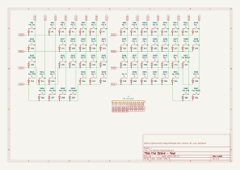

# Five Octave

A 61-key (5-octave) keyboard.

## Layout

📄 [keyboard-layout.png](layout/keyboard-layout.png) (v0.1.1)


**RAW data for Keyboard Layout Editor v0.15:**

📄 [keyboard-layout.rawdata.json](layout/keyboard-layout.rawdata.json)

```json
[{"a":4,"f":3},"Esc","!\n1","@\n2","#\n3","$\n4","%\n5","^\n6","&\n7","*\n8","(\n9",")\n0","_\n-","+\n=","|\n\\","~\n`"],
[{"w":1.5},"Tab","Q","W","E","R","T","Y","U","I","O","P","{\n[","}\n]",{"w":1.5},"BS"],
[{"w":1.75},"Caps","A","S","D","F","G","H","J","K","L",":\n;","\"\n'",{"w":2.25},"Return"],
[{"w":2.25},"Shift","Z","X","C","V","B","N","M","<\n,",">\n.","?\n/",{"w":1.75},"Shift","Fn"],
[{"w":1.25},"Ctrl",{"w":1.25},"Opt",{"w":1.25},"Cmd",{"a":7,"w":6.25},"6.25u",{"a":4},"Cmd","MO(1)"]
```

- 🔗 [Keyboard Layout Editor](http://www.keyboard-layout-editor.com/)

## BOM

### Five Octave CPU Board

| Material | Symbol | QTY | Note | JLCPCB Part # |
|-|-|-:|-|-|
| RP2040 | | 1 | MCU, Raspberry Pi | [C2040](https://jlcpcb.com/partdetail/RaspberryPi-RP2040/C2040) |
| W25Q64JVXGIQ | | 1 | 64M-bit Serial Flash, Winbond Electronics | [C2940195](https://jlcpcb.com/partdetail/WinbondElec-W25Q64JVXGIQ/C2940195) |

### Five Octave Keys Board

| Material | Symbol | QTY | Note | JLCPCB Part # |
|-|-|-:|-|-|
| 1N4148WS | D1-61 | 61 | | [C2128](https://jlcpcb.com/partdetail/2485-1N4148WS/C2128) |
| CPG151101S11-16 | SW1-61 | 61 | Kailh How Swap Socket | [C5156480](https://jlcpcb.com/partdetail/Kailh-CPG151101S1116/C5156480) | 
| AFC01-S16FCC-00 | J1 | 1 | JUSHUO FFC Connector (0.50mm pitch, 16 circuits) | [C262272](https://jlcpcb.com/partdetail/Jushuo-AFC01_S16FCC00/C262272) |

- 🔗 [JLCPCB | Assembly Parts Lib](https://jlcpcb.com/parts)

## Schematic

### Five Octave Keys Board

📄 [Five_Octave_Keys.kicad_sch](electronics/Five_Octave_Keys/Five_Octave_Keys.kicad_sch) (v0.4.1)

📄 [Five_Octave_Keys.svg](electronics/Five_Octave_Keys/Five_Octave_Keys.svg)



#### Key-matrix (8x8)

|    | C0    | C1   | C2  | C3  | C4    | C5    | C6     | C7    |
|----|-------|------|-----|-----|-------|-------|--------|-------|
| R0 | Esc   |      | 1   | 2   | 3     | 4     | 5      | 6     |
| R1 | Tab   |      |     | Q   | W     | E     | R      | T     |
| R2 | Caps  | Z    | X   | A   | S     | D     | F      | G     | 
| R3 | Shift | Ctrl | Opt | Cmd | Space | C     | V      | B     |
| R4 | 7     | 8    | 9   | 0   | -     | =     | \      | `     |
| R5 | Y     | U    | I   | O   | P     | [     | ]      | BS    |
| R6 | H     | J    | K   | L   | ;     | '     | Return | Fn    |
| R7 | N     | M    | ,   | .   | /     | Shift | Cmd    | MO(1) | 
