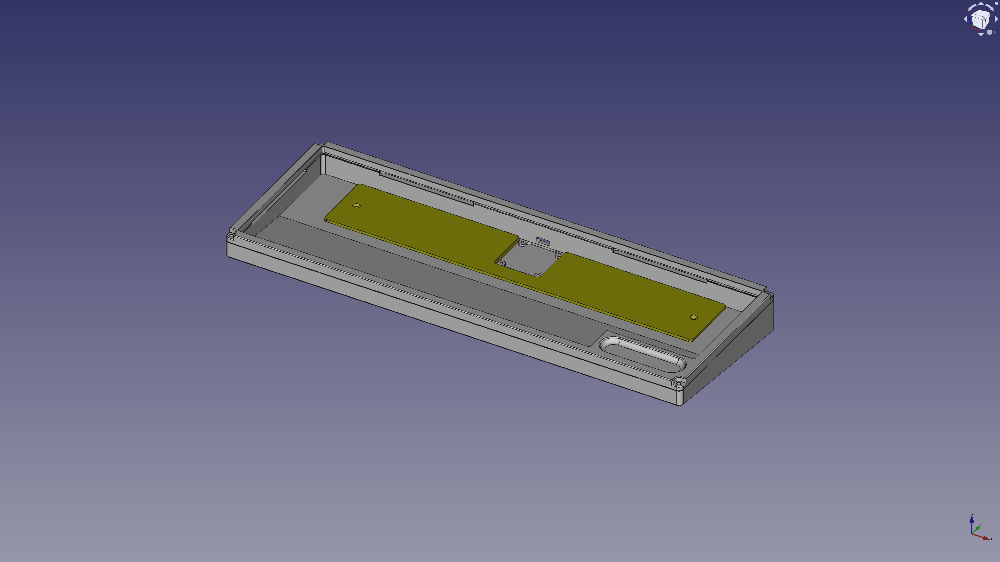
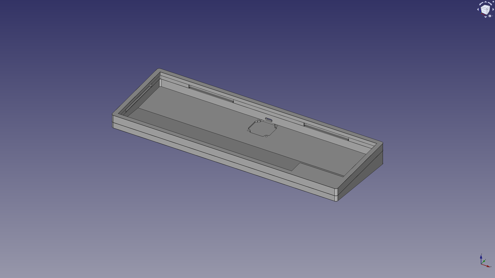

# Five Octave

A 61-key (5-octave) keyboard.


## Layout

**Layer 0**:

📄 [keyboard-layout.png](layout/keyboard-layout.png) (v0.3.0)


MEMO: When pressed individually and released, it becomes the lower right keys (英数 and かな).

**Layer 1**:

📄 [keyboard-layout-1.png](layout/keyboard-layout-1.png)


**Layer 2**:

📄 [keyboard-layout-2.png](layout/keyboard-layout-2.png)


MEMO: I couldn't figure out how to achieve 'fn' with adafruit_hid, so I'm using Karabiner to remap right_option to 'fn' and using it that way.

**RAW data for Keyboard Layout Editor v0.15:**

📄 [keyboard-layout.rawdata.json](layout/keyboard-layout.rawdata.json)

```json
[{"a":4,"f":3},"Esc","!\n1","@\n2","#\n3","$\n4","%\n5","^\n6","&\n7","*\n8","(\n9",")\n0","_\n-","+\n=","|\n\\","~\n`"],
[{"w":1.5},"Tab","Q","W","E","R","T","Y","U","I","O","P","{\n[","}\n]",{"w":1.5},"BS"],
[{"w":1.75},"MO(1)\n\n\n英数","A","S","D","F","G","H","J","K","L",":\n;","\"\n'",{"w":2.25},"Return"],
[{"w":2.25},"Shift","Z","X","C","V","B","N","M","<\n,",">\n.","?\n/",{"w":1.75},"Shift","MO(2)"],
[{"w":1.25},"Ctrl",{"w":1.25},"Opt",{"w":1.25},"Cmd\n\n\n英数",{"a":7,"w":6.25},"6.25u",{"a":4},"Cmd\n\n\nかな","Opt"]
```

📄 [keyboard-layout-1.rawdata.json](layout/keyboard-layout-1.rawdata.json)

```json
[{"a":4,"f":3},"Esc",{"c":"#aaccaa"},"F1","F2","F3","F4","F5","F6","F7","F8","F9","F10","F11","F12",{"c":"#cccccc"},"|\n\\","~\n`"],
[{"w":1.5},"Tab",{"c":"#aaccaa"},"Home","Up","End","PgUp",{"c":"#cccccc"},"T","Y","BS",{"c":"#cccccc"},"I","O","P","{\n[","}\n]",{"w":1.5},"BS"],
[{"c":"#aaccaa","w":1.75},"","Left","Down","Right","PgDn",{"c":"#cccccc"},"G",{"c":"#aaccaa"},"Enter","kana",{"c":"#cccccc"},"K","L",":\n;","\"\n'",{"w":2.25},"Return"],
[{"w":2.25},"Shift","Z","X","C","V","B","N","M","<\n,",">\n.","?\n/",{"w":1.75},"Shift",{"c":"#aaccaa"},"",{"c":"#cccccc"}],
[{"w":1.25},"Ctrl",{"w":1.25},"Opt",{"w":1.25},"Cmd\n\n\n英数",{"a":7,"w":6.25},"6.25u",{"a":4},"Cmd\n\n\nかな","Opt"]
```

📄 [keyboard-layout-2.rawdata.json](layout/keyboard-layout-2.rawdata.json)

```json
[{"a":4,"f":3},"Esc",{"c":"#aaccaa"},"F1","F2","F3","F4","F5","F6","F7","F8","F9","F10","F11","F12",{"c":"#cccccc"},"|\n\\","~\n`"],
[{"w":1.5},"Tab","Q","W","E","R","T","Y","U","I","O","P",{"c":"#aaccaa"},"Up",{"c":"#cccccc"},"}\n]",{"w":1.5},"BS"],
[{"c":"#aaccaa","w":1.75},"CapsLock",{"c":"#cccccc"},"A","S","D","F","G","H","J","K","L",{"c":"#aaccaa"},"left","right",{"c":"#cccccc","w":2.25},"Return"],
[{"w":2.25},"Shift","Z","X","C","V","B","N","M","<\n,",">\n.",{"c":"#aaccaa"},"Down",{"c":"#cccccc","w":1.75},"Shift",{"c":"#aaccaa"},"",{"c":"#cccccc"}],
[{"w":1.25},"Ctrl",{"w":1.25},"Opt",{"w":1.25},"Cmd\n\n\n英数",{"a":7,"w":6.25},"6.25u",{"a":4},"Cmd\n\n\nかな","Opt"]]
```

- 🔗 [Keyboard Layout Editor](http://www.keyboard-layout-editor.com/)

## BOM

| Material | QTY | Note |
|-|-:|-|
| Five Octave MCU Board | 1 | |
| Five Octave Keys Board | 1 | |
| Five Octave Enclosure | 1 | |
| 0151660169 | 1 | Molex 0.50mm pitch FFC, Type A, 127.00mm, 16 circuits |

- 🔗 [Molex Connector Part Number - 15166-0169 | Molex](https://www.molex.com/en-us/products/part-detail/151660169)

### Five Octave MCU Board

| Material | Symbol | QTY | Note | JLCPCB Part # |
|-|-|-:|-|-|
| 30pF 0402 | C1, C2 | 2 | | [C1570](https://jlcpcb.com/partdetail/1922-0402CG300J500NT/C1570) |
| 1uF 0402 | C3, C4 | 2 | | [C52923](https://jlcpcb.com/partdetail/53938-CL05A105KA5NQNC/C52923) |
| 100nF 0402 | C5-C14 | 10 | | [C307331](https://jlcpcb.com/partdetail/291005-CL05B104KB54PNC/C307331) |
| 10uF 0402 | C15, C16 | 2 | | [C15525](https://jlcpcb.com/partdetail/16204-CL05A106MQ5NUNC/C15525) |
| HRO_TYPE-C-31-M-12 | J1 | 1 | USB Type-C Connector, Korean Hroparts Elec | [C165948](https://jlcpcb.com/partdetail/Korean_HropartsElec-TYPE_C_31_M12/C165948) |
| AFC01-S16FCC-00 | J2 | 1 | FFC Connector 0.50mm pitch 16 circuits, JUSHUO | [C262272](https://jlcpcb.com/partdetail/Jushuo-AFC01_S16FCC00/C262272) |
| WS2812C-2020-V1 | LED1 | 1 | NeoPixel RGB LED 2x2mm, Worldsemi | [C2976072](https://jlcpcb.com/partdetail/Worldsemi-WS2812C_2020V1/C2976072) |
| 10KΩ 0402 | R1, R3 | 2 | | [C25744](https://jlcpcb.com/partdetail/26487-0402WGF1002TCE/C25744) |
| 1KΩ 0402 | R2, R4 | 2 | | [C11702](https://jlcpcb.com/partdetail/12256-0402WGF1001TCE/C11702) |
| 27Ω 0402 | R5, R6 | 2 | | [C352446](https://jlcpcb.com/partdetail/Resi-AECR0402F27R0K9/C352446) |
| 5.1KΩ 0402 | R7, R8 | 2 | | [C25905](https://jlcpcb.com/partdetail/26648-0402WGF5101TCE/C25905) |
| SKRPANE010 | SW1, SW2 | 2 | Tactile Switch, ALPS ALPINE | [C470426](https://jlcpcb.com/partdetail/Alpsalpine-SKRPANE010/C470426) |
| RP2040 | U1 | 1 | MCU, Raspberry Pi | [C2040](https://jlcpcb.com/partdetail/RaspberryPi-RP2040/C2040) |
| W25Q64JVXGIQ | U2 | 1 | 64M-bit Serial Flash, Winbond Electronics | [C2940195](https://jlcpcb.com/partdetail/WinbondElec-W25Q64JVXGIQ/C2940195) |
| AP2112K-3.3TRG1 | U3 | 1 | 3.3V Linear Voltage Regulators | [C51118](https://jlcpcb.com/partdetail/DiodesIncorporated-AP2112K_33TRG1/C51118) |
| X322512MSB4SI | Y1 | 1 | 12MHz 20pF Crystal Resonator, SMD-3225, Yangxing Tech | [C9002](https://jlcpcb.com/partdetail/YangxingTech-X322512MSB4SI/C9002) | 

### Five Octave Keys Board

| Material | Symbol | QTY | Note | JLCPCB Part # |
|-|-|-:|-|-|
| 1N4148WS | D1-D61 | 61 | | [C2128](https://jlcpcb.com/partdetail/2485-1N4148WS/C2128) |
| CPG151101S11-16 | SW1-SW61 | 61 | How Swap Socket, Kailh | [C5156480](https://jlcpcb.com/partdetail/Kailh-CPG151101S1116/C5156480) | 
| AFC01-S16FCC-00 | J1 | 1 | FFC Connector 0.50mm pitch 16 circuits, JUSHUO | [C262272](https://jlcpcb.com/partdetail/Jushuo-AFC01_S16FCC00/C262272) |

- 🔗 [JLCPCB | Assembly Parts Lib](https://jlcpcb.com/parts)

### Five Octave Enclosure

| Material | Symbol | QTY | Note |
|-|-|-:|-|
| Five Octave Enclosure - Case || 1 | (or Enclosure v2) |
| Five Octave Enclosure - Top Frame || 1 | (or Enclosure v2) |
| Screw M2 x 8mm || 4 | Secure Case and Top Frame |
| Screw M2 x 5mm or 4mm || 4 | Secure Case and Five Octave MCU |
| Poron 1.5t 3mm x 120mm || 2 | For gasket mounting |
| Poron 1.5t 3mm x 60mm || 6 | For gasket mounting |
| Poron 1.5t 3mm x 40mm || 2 | For gasket mounting |

## Schematic and PCB

### Five Octave MCU

📄 [Five_Octave_MCU.kicad_sch](electronics/Five_Octave_MCU/Five_Octave_MCU.kicad_sch) (v1.0.0)

📄 [Five_Octave_MCU.kicad_pcb](electronics/Five_Octave_MCU/Five_Octave_MCU.kicad_pcb) (v1.0.0)

📄 [Five_Octave_MCU.svg](electronics/Five_Octave_MCU/Five_Octave_MCU.svg)


### Five Octave Keys

📄 [Five_Octave_Keys.kicad_sch](electronics/Five_Octave_Keys/Five_Octave_Keys.kicad_sch) (v1.0.0)

📄 [Five_Octave_Keys.kicad_pcb](electronics/Five_Octave_Keys/Five_Octave_Keys.kicad_pcb) (v1.0.0)

📄 [Five_Octave_Keys.svg](electronics/Five_Octave_Keys/Five_Octave_Keys.svg)


#### Key-matrix (8x8)

|    | C0    | C1   | C2  | C3  | C4    | C5    | C6     | C7    |
|----|-------|------|-----|-----|-------|-------|--------|-------|
| R0 | Esc   |      | 1   | 2   | 3     | 4     | 5      | 6     |
| R1 | Tab   |      |     | Q   | W     | E     | R      | T     |
| R2 | Caps  | Z    | X   | A   | S     | D     | F      | G     | 
| R3 | Shift | Ctrl | Opt | Cmd | Space | C     | V      | B     |
| R4 | 7     | 8    | 9   | 0   | -     | =     | \      | `     |
| R5 | Y     | U    | I   | O   | P     | [     | ]      | BS    |
| R6 | H     | J    | K   | L   | ;     | '     | Return | Fn    |
| R7 | N     | M    | ,   | .   | /     | Shift | Cmd    | MO(1) | 

## Mechanics

### Five Octave Enclosure

📄 [Five_Octave_Enclosure.FCStd](mechanics/Five_Octave_Enclosure.FCStd) (v1.0.1)




### Five Octave Enclosure v2

📄 [Five_Octave_Enclosure_v2.FCStd](mechanics/Five_Octave_Enclosure_v2.FCStd) (v2.1.2)




### Plate

📄 [Five_Octave_Plate.kicad_pcb](electronics/Five_Octave_Plate/Five_Octave_Plate.kicad_pcb) (v1.0.0)

## Firmware

You can use Vial or CircuitPython.

### Vial

- Built UF2
    - 📄 [takayoshiotake_five_octave_vial_20240103.uf2](vial-bin/takayoshiotake_five_octave_vial_20240103.uf2)

See [vial-porting](vial-porting) for more details.

### CircuitPython

Software for the Five Octave runs on CircuitPython.
Its CircuitPython is the same as the one for Octave (<https://github.com/takayoshiotake/octave-12-key-macropad>).

- Built UF2
    - 🔗 <https://adafruit-circuit-python.s3.amazonaws.com/index.html?prefix=bin/takayoshiotake_octave_rp2040/>
    - 📄 [adafruit-circuitpython-takayoshiotake_octave_rp2040-en_US-8.2.6.uf2](circuitpython-bin/adafruit-circuitpython-takayoshiotake_octave_rp2040-en_US-8.2.6.uf2)
- Code
    - 🔗 [adafruit/circuitpython](https://github.com/adafruit/circuitpython)
        - 🔗 <https://github.com/adafruit/circuitpython/tree/main/ports/raspberrypi/boards/takayoshiotake_octave_rp2040>

See [circuitpython-app/README.md](software/README.md) for application software.

## Gallery

Keycap: Drop + biip MT3 Extended 2048


MEMO: Alminum 6061 CNC + Bead blasting 120 mesh + Anodizing natural matte by JLCPCB (Five Octave Enclosure v1.0.0)

### Photos with Enclosure v2

Keycap: Drop + biip MT3 Extended 2048


MEMO: Alminum 6061 CNC + Bead blasting 150 mesh + Hardcoat anodizing natural matte by JLCPCB (Five Octave Enclosure v2.1.1)
